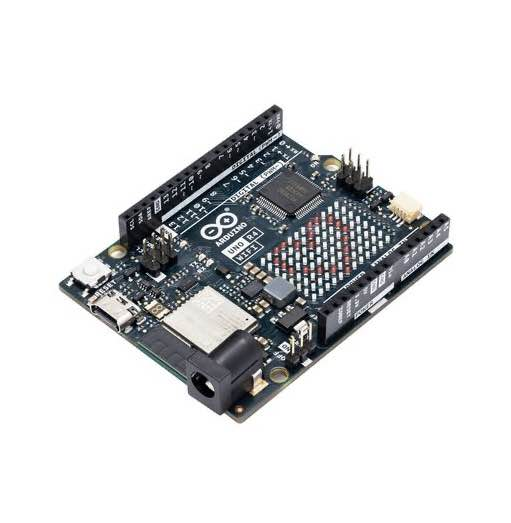
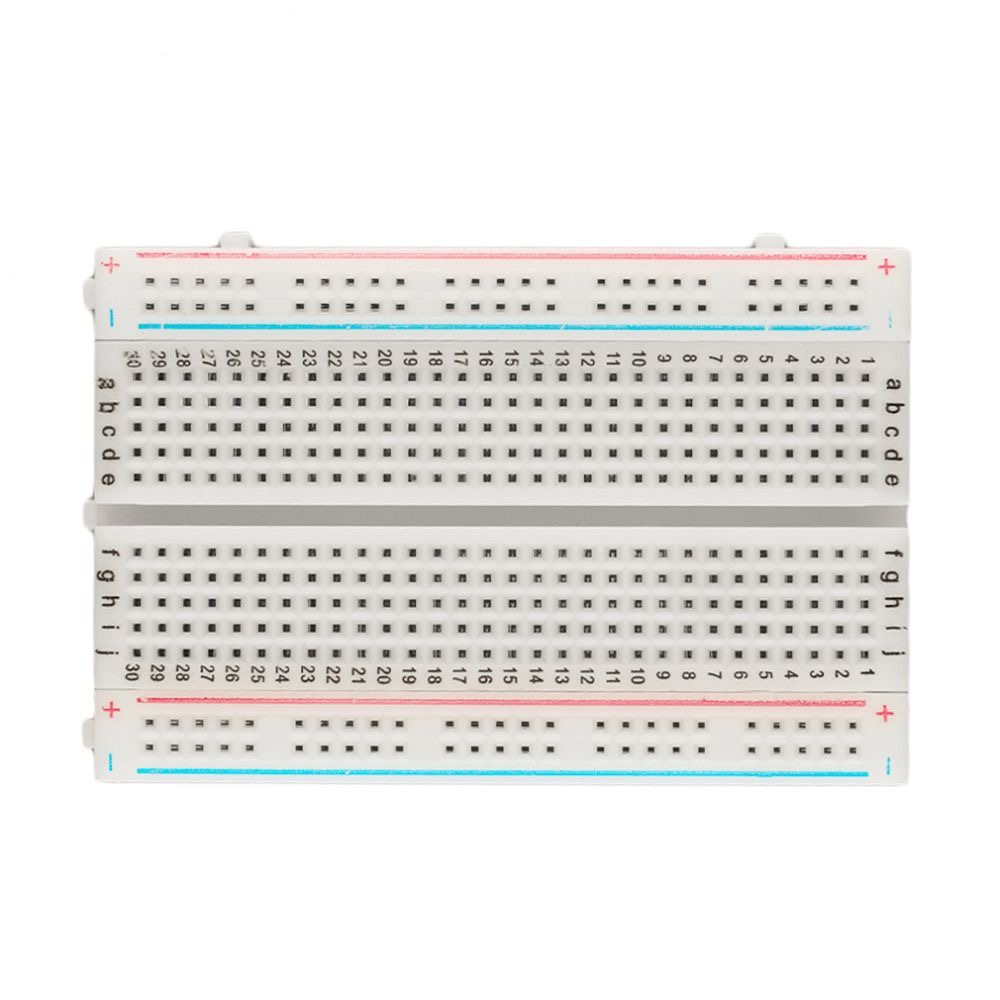
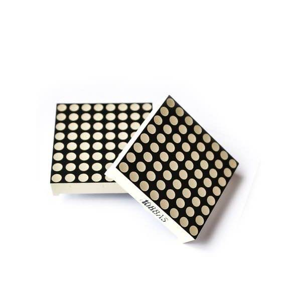
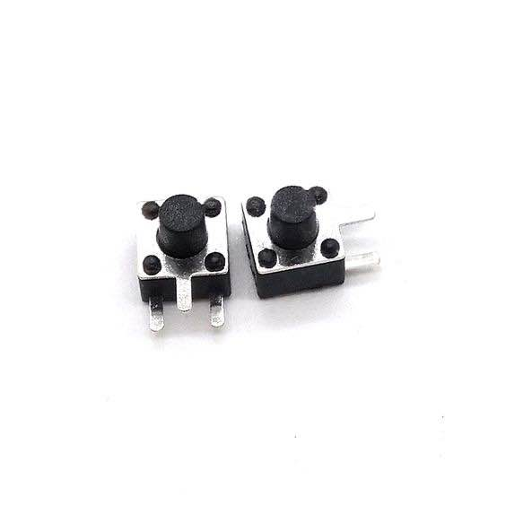

# Physical Computing Project 2024 - IT KMITL
TERTRIS-LED-DOT_MATRIX

## บทคัดย่อ (abstract)
โครงงานนี้เป็นการใช้ Microcontroller ในการควบคุมการบังคับของเกม TETRIS ด้วยการแสดงผลผ่าน Led Dot Matrix MAX7219 และควบคุมด้วย micro switch แทนการใช้ keyboard ปกติในการเล่น เราจะใช้ปุ่มต่าง ๆ เป็นฟังก์ชันต่าง ๆ ของเกม TETRIS แทนการขยับทางด้านซ้าย, แทนการขยับทางด้านขวา, แทนการลงของวัตถุ, แทนการหมุนของตัววัตถุ

## วิธีการเล่น
1. บล็อกหายรูปทรงจะตกลงมาจากด้านบน ต้องหมุนและจัดเรียงบล็อกให้เต็มแถวแนวนอน
2. เมื่อแถวแนวนอนเต็ม บล็อกในแถวนั้นจะหายไป ทำให้มีพื้นที่ว่างเพิ่มขึ้น
3. เกมจะดำเนินต่อไปเรื่อย ๆ จนกว่าบล็อกจะกองเต็มจนถึงด้านบนสุดของหน้าจอ

## อุปกรณ์ที่ใช้ทั้งหมด
- **Arduino UNO R4 WiFi** 
 
- **Breadborad** 
 
- **Led Dot Matrix MAX7219** 
 
- **Micro Switch** 
 

## Poster

## Website แสดงรายละเอียดโครงงาน
[Website](https://realnena.github.io/tetris.github.io/)

## [Demo Video](https://youtu.be/kFzVgla7_yU?feature=shared)
สมาชิกกลุ่ม
| ลำดับ | ชื่อ - นามสกุล | รหัสนักศึกษา |
|----------|----------|----------|
| 1. | นายกิตติพิชญ์ หิรัญวงศ์ | 66070018 |
| 2. | นางสาวสู่ขวัญ การุญ | 66070210 |
| 3. | นายชัชวาลย์ ทองศิริกุล | 66070250 |
| 4. | นายพงศกร ศรีเจริญ | 66070292 |
